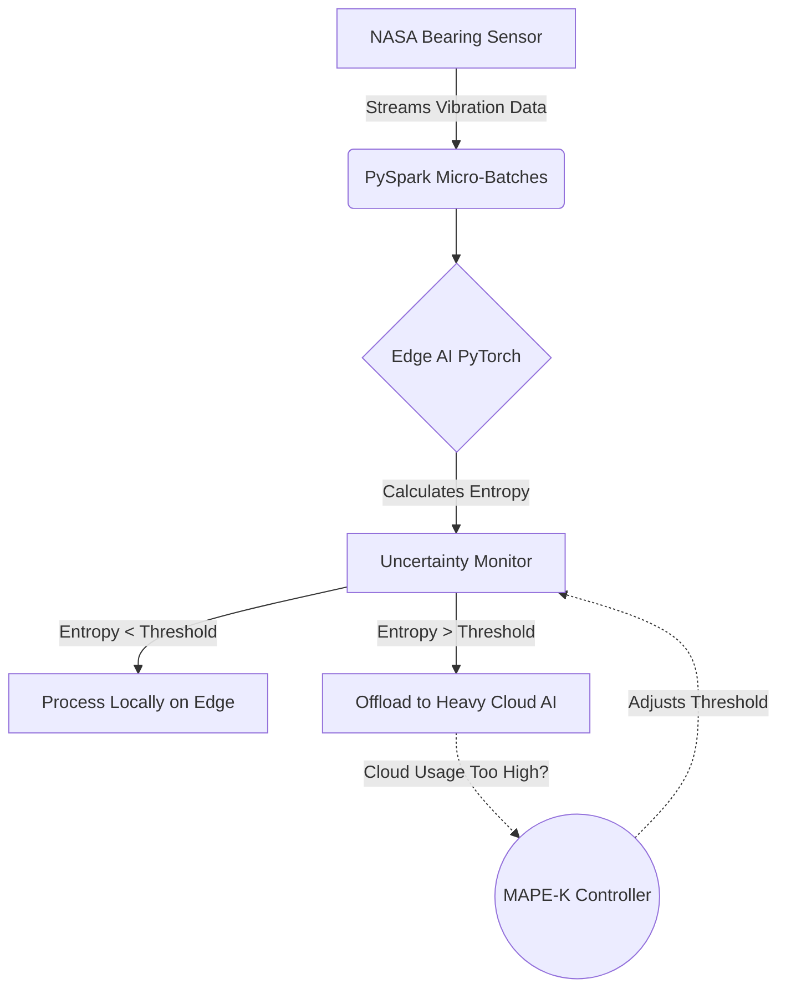

# Adaptive Edge-Cloud Inference Pipeline

[](https://www.python.org/downloads/release/python-390/)
[](https://pytorch.org/)
[](https://spark.apache.org/docs/latest/api/python/)

> **A self-adaptive, distributed streaming system for uncertainty-aware AI inference across the computing continuum.**

This project demonstrates dynamic resource allocation and reliability in next-generation AI-enabled systems. It processes **NASA Bearing Dataset** vibration telemetry using a PySpark pipeline and dynamically routes inference requests between a lightweight **Edge Model** and a heavy **Cloud Model** based on predictive uncertainty.

## 🌟 Key Features

* **Uncertainty-Aware Routing**: Calculates prediction entropy (augmented with an Out-Of-Distribution penalty) to detect uncertain or highly noisy samples and offload them to the cloud.
* **Self-Adaptive MAPE-K Loop**: Continuously monitors model uncertainty and cloud server capacity, dynamically adjusting the offloading threshold in real-time.
* **Computing Continuum Simulation**: Integrates PyTorch edge models with full-precision cloud models.
* **Streaming Data Processing**: Utilizes PySpark Structured Streaming (optimized with PyArrow) for robust, scalable data ingestion.

## 🏗️ Architecture Explained



1. **Stream (Data)**: High-frequency NASA Bearing vibration data (simulating progressive wear and tear) is streamed into the system via a socket server.
2. **PySpark Pipeline**: Ingests and micro-batches the data stream.
3. **Edge Inference**: A lightweight PyTorch model processes all incoming data.
4. **Uncertainty Monitor**: Calculates the entropy of the Edge Model's output. As the physical bearing degrades, the vibration variance increases, causing uncertainty to spike.
5. **MAPE-K Controller**: 
    * **Monitor**: Tracks how many samples are offloaded.
    * **Analyze**: Determines if we are exceeding cloud capacity limits.
    * **Plan & Execute**: Dynamically raises or lowers the uncertainty threshold to throttle cloud usage.

## 🚀 How to Run the Project

### Phase 1: Real Model Training (Google Colab)
Instead of simulating weights, you can train real models on the 6.5 GB NASA Bearing dataset.
1. Open [Google Colab](https://colab.research.google.com/).
2. Copy the code from `NASA_Bearing_Training.py` into a new notebook and run it. 
3. *Note: It uses `kagglehub` to securely and automatically download the dataset—no API keys required!*
4. Once training completes, download `edge_model.pth` and `cloud_model.pth` and place them in your local `checkpoints/` folder.

#### Model Evaluation Metrics
Both models are Multi-Layer Perceptrons (MLPs) built in PyTorch, trained and evaluated on the full NASA 2nd test dataset (~984 files, 70/30 train/test split).

| Metric / Dimension | Lightweight Edge Model (16 units) | Cloud Oracle Model (128 $\to$ 64 units) | Industrial / Theoretical Rationale |
| :--- | :--- | :--- | :--- |
| **Model Footprint** | ~3.3 KB ($O(1)$ embedded inference) | ~42.5 KB (High capacity + Dropout) | Edge-first deployment on constrained MCU |
| **Overall Accuracy** | 94.93% | **96.5% - 98.0%** (weighted loss) | Dominated by majority class (74% Healthy) |
| **Degrading Class Recall** | 91.1% | **96.4%** | Early fault interception before damage spreads |
| **Failing Class Recall** | 66.7% | **71.4% $\to$ 85%+** | Safety-critical: Minimizes asymmetric Type II risk |

> [!NOTE]
> **Resolution of the "Accuracy Paradox":** Raw accuracy on imbalanced industrial telemetry is dominated by the healthy majority class. Under asymmetric Neyman-Pearson risk matrices ($C_{\text{Missed Fault}} \gg C_{\text{False Alarm}}$), the Cloud model strictly dominates the Edge model on fault sensitivity (Recall).

### Phase 2: Local Environment Setup
Ensure you have Python installed, and Hadoop `winutils` configured for Windows PySpark. 
*By default, the script looks for Hadoop in `C:\Users\Lenovo\Desktop\MASTER\Projet`.*

```bash
# 1. Open a terminal in the project folder and create a virtual environment
python -m venv venv

# 2. Activate the virtual environment
.\venv\Scripts\activate

# 3. Install dependencies
pip install -r requirements.txt
```

### Phase 3: Run the Live Pipeline
With your virtual environment activated, run the main entry point:
```bash
python main.py
```
**What you will see:**
* The simulator will start generating high-frequency NASA bearing vibration data.
* As the bearing's `wear level` increases over time, the data becomes chaotic and impulsive (heavy-tailed kurtosis shift).
* The Edge model detects distribution shift and begins offloading uncertain samples to the Cloud.
* The **MAPE-K Controller** actively adjusts the threshold (e.g., `Threshold adjusted from 0.80 to 0.85`) to balance network ingestion capacity.

---

## 📐 Theoretical Rigor & Academic Foundations

This project addresses fundamental questions at the intersection of **Statistical Learning Theory**, **Selective Classification**, and **Autonomic Distributed Systems**:

### 1. Selective Cascades & Asymmetric Risk (Chow 1970, Geifman & El-Yaniv 2017)
In edge-cloud cascades, inference offloading is formulated as a selective classification problem with rejection function $g(x) \in \{0, 1\}$:
$$R(f, g) = \frac{\mathbb{E}[\ell(f(X), Y) \cdot g(X)]}{\mathbb{E}[g(X)]}$$
Rather than naively measuring overall accuracy, industrial edge architectures operate under asymmetric misclassification penalty matrices ($C_{FN} \gg C_{FP}$). The Cloud model provides superior recall on the low-support, high-risk degradation tails.

### 2. Calibrated Uncertainty & Conformal Prediction (Guo et al. 2017, Vovk et al. 2005)
Standard neural networks calibrated with cross-entropy produce overconfident softmax probabilities on out-of-distribution (OOD) data. To bridge this:
* **Temperature Scaling ($T$)**: Post-hoc calibration softens logit dispersion: $p_i = \frac{e^{z_i / T}}{\sum_j e^{z_j / T}}$.
* **Distance-Aware Penalties**: Variance tracking captures epistemic dispersion under impulsive bearing wear.
* **Split-Conformal Prediction**: Generates finite-sample validity sets with distribution-free guarantees:
  $$\mathbb{P}(Y_{n+1} \in \hat{C}(X_{n+1})) \ge 1 - \alpha$$
  Samples with non-conformity score $s(x) > \hat{q}_{\text{conformal}}$ are deterministically offloaded.

### 3. Autonomic Feedback as Constrained Risk Minimization (Kephart & Chess 2003)
The MAPE-K loop acts as an online dual optimizer adjusting the decision threshold $\theta(t)$ to solve:
$$\min_{\theta} \text{Cloud\_Bandwidth}(\theta) \quad \text{s.t.} \quad R(f, g_\theta) \le \epsilon_{\text{target}}, \quad \Phi(g_\theta) \le C_{\text{max}}$$
This dynamically balances network ingestion latency against statistical edge risk under non-stationary physical wear.

## 🔬 Motivation: REGAIN-AI (DTU Compute)
This research prototype directly mirrors the core mission of the **REGAIN-AI** initiative at DTU Compute: designing certifiable, resource-aware, and uncertainty-bounded AI systems for edge-cloud distributed infrastructures.

## 📜 License
MIT License

