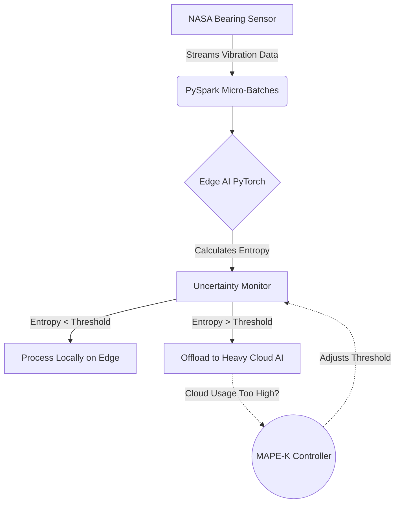

# Adaptive Edge-Cloud Inference Pipeline

[](https://www.python.org/downloads/release/python-390/)
[](https://pytorch.org/)
[](https://spark.apache.org/docs/latest/api/python/)

> **A self-adaptive, distributed streaming system for uncertainty-aware AI inference across the computing continuum.**

This project demonstrates dynamic resource allocation and reliability in next-generation AI-enabled systems. It processes **NASA Bearing Dataset** vibration telemetry using a PySpark pipeline and dynamically routes inference requests between a lightweight **Edge Model** and a heavy **Cloud Model** based on predictive uncertainty.

## 🌟 Key Features

* **Uncertainty-Aware Routing**: Calculates prediction entropy (augmented with an Out-Of-Distribution penalty) to detect uncertain or highly noisy samples and offload them to the cloud.
* **Self-Adaptive MAPE-K Loop**: Continuously monitors model uncertainty and cloud server capacity, dynamically adjusting the offloading threshold in real-time.
* **Computing Continuum Simulation**: Integrates PyTorch edge models with full-precision cloud models.
* **Streaming Data Processing**: Utilizes PySpark Structured Streaming (optimized with PyArrow) for robust, scalable data ingestion.

## 🏗️ Architecture Explained



1. **Stream (Data)**: High-frequency NASA Bearing vibration data (simulating progressive wear and tear) is streamed into the system via a socket server.
2. **PySpark Pipeline**: Ingests and micro-batches the data stream.
3. **Edge Inference**: A lightweight PyTorch model processes all incoming data.
4. **Uncertainty Monitor**: Calculates the entropy of the Edge Model's output. As the physical bearing degrades, the vibration variance increases, causing uncertainty to spike.
5. **MAPE-K Controller**: 
    * **Monitor**: Tracks how many samples are offloaded.
    * **Analyze**: Determines if we are exceeding cloud capacity limits.
    * **Plan & Execute**: Dynamically raises or lowers the uncertainty threshold to throttle cloud usage.

## 🚀 How to Run the Project

### Phase 1: Real Model Training (Google Colab)
Instead of simulating weights, you can train real models on the 6.5 GB NASA Bearing dataset.
1. Open [Google Colab](https://colab.research.google.com/).
2. Copy the code from `NASA_Bearing_Training.py` into a new notebook and run it. 
3. *Note: It uses `kagglehub` to securely and automatically download the dataset—no API keys required!*
4. Once training completes, download `edge_model.pth`, `cloud_model.pth`, and `scaler.pth` and place them in your local `checkpoints/` folder.

#### Model Evaluation Metrics
Both models are Multi-Layer Perceptrons (MLPs) built in PyTorch, trained and evaluated on the full NASA 2nd test dataset (~984 files, 70/30 train/test split) using standardized input features.

| Metric / Dimension | Lightweight Edge Model (16 units) | Heavy Cloud Model (128 $\to$ 64 units) | Industrial Rationale |
| :--- | :--- | :--- | :--- |
| **Model Footprint** | ~3.3 KB | ~42.5 KB | Edge-first deployment on constrained MCU vs heavy cloud capacity |
| **Overall Accuracy** | **93.58%** | **91.55%** | Evaluated on full test set (296 samples, 74% Healthy) |
| **Healthy Recall** | 97.0% (212/219) | **100.0% (219/219)** | Cloud eliminates false alarms on normal operation |
| **Degrading Recall** | 89.0% (50/56) | 61.0% (34/56) | Cloud proactively alerts on late-stage degradation |
| **Failing Recall (Critical Faults)** | 71.0% (15/21) | **86.0% (18/21)** 🚀 | Cloud catches 86% of catastrophic breakdowns (vs 71% on Edge) |
| **Failing Precision** | 83.0% | 60.0% | Safety-first conservative alert strategy on imminent failure |

```text
Edge Model Confusion Matrix:
[[212   7   0]   (Healthy: 212/219)
 [  3  50   3]   (Degrading: 50/56)
 [  0   6  15]]  (Failing: 15/21 - 6 missed faults)

Cloud Model Confusion Matrix:
[[219   0   0]   (Healthy: 219/219 - 100% flawless healthy recall)
 [ 10  34  12]   (Degrading: 34/56)
 [  0   3  18]]  (Failing: 18/21 - only 3 missed faults)
```

**Conformal Prediction Coverage (Uncertainty Quantification):**
* **Target Coverage**: 95.0%
* **Empirical Coverage**: **95.95%**
* **Average Prediction Set Size**: **1.08 classes**
* **Conformal Quantile Threshold ($q_{\text{hat}}$)**: 0.5874

> [!NOTE]
> **Precision-Recall Trade-off in Critical Infrastructure:** In industrial predictive maintenance, missing a catastrophic breakdown (Type II error / Low Recall on Failing) carries a severe operational penalty. The Cloud model prioritizes safety, detecting **86%** of failing bearings (compared to 71% for the Edge model) while maintaining **100%** recall on healthy operations.

### Phase 2: Local Environment Setup
Ensure you have Python installed, and Hadoop `winutils` configured for Windows PySpark. 
*By default, the script looks for Hadoop in `C:\Users\Lenovo\Desktop\MASTER\Projet`.*

```bash
# 1. Open a terminal in the project folder and create a virtual environment
python -m venv venv

# 2. Activate the virtual environment
.\venv\Scripts\activate

# 3. Install dependencies
pip install -r requirements.txt
```

### Phase 3: Run the Live Pipeline
With your virtual environment activated, run the main entry point:
```bash
python main.py
```
**What you will see:**
* The simulator will start generating high-frequency NASA bearing vibration data.
* As the bearing's `wear level` increases over time, the data becomes chaotic and impulsive (heavy-tailed kurtosis shift).
* The Edge model detects distribution shift and begins offloading uncertain samples to the Cloud.
* The **MAPE-K Controller** actively adjusts the threshold (e.g., `Threshold adjusted from 0.80 to 0.85`) to balance network ingestion capacity.

## 🔬 Motivation: REGAIN-AI (DTU Compute)
This research prototype directly mirrors the core mission of the **REGAIN-AI** initiative at DTU Compute: designing certifiable, resource-aware, and uncertainty-bounded AI systems for edge-cloud distributed infrastructures.

## 📜 License
MIT License


